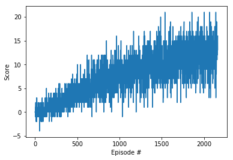

# Report

## Learning algorithm and parameters used

The learning algorithm is a Deep Q Learning algorithm (DQN), which combines a Q learning algorithm with a neural network of our choice. The neural network we have chosen is plain (only contains 3 fully connected neural networks). The input is a vector of state and includes the following layers:

- Fully connected layer: input: 37, output: 128
- Fully connected layer: input: 128, output: 64
- Fully connected layer: input: 64, output: 4

The following hyperparameters were used in the DQN algorithm:
- Maximum steps per episode: 1000
- Start epsilon 1.0
- end epsilon 0.01
- Epsilon decay rate: 0.999

## Results

Episode 100 &nbsp;	Average Score: 0.19  
Episode 200 &nbsp;	Average Score: 0.93  
Episode 300 &nbsp;	Average Score: 1.44  
Episode 400 &nbsp;	Average Score: 2.35  
Episode 500 &nbsp;	Average Score: 3.55  
Episode 600 &nbsp;	Average Score: 4.53  
Episode 700 &nbsp;	Average Score: 5.42  
Episode 800 &nbsp;	Average Score: 6.37  
Episode 900 &nbsp;	Average Score: 6.95  
Episode 1000 &nbsp;	Average Score: 7.60  
Episode 1100 &nbsp;	Average Score: 7.58  
Episode 1200 &nbsp;	Average Score: 8.40  
Episode 1300 &nbsp;	Average Score: 8.81  
Episode 1400 &nbsp;	Average Score: 9.85  
Episode 1500 &nbsp; 	Average Score: 10.53  
Episode 1600 &nbsp;	Average Score: 10.00  
Episode 1700 &nbsp;	Average Score: 11.01  
Episode 1800 &nbsp;	Average Score: 11.82  
Episode 1900 &nbsp;	Average Score: 11.28  
Episode 2000 &nbsp;	Average Score: 11.97  
Episode 2100 &nbsp;	Average Score: 12.54  
Episode 2163 &nbsp;	Average Score: 13.04  
Environment solved in 2063 episodes!	Average Score: 13.04  

So as long as the average score ended up being above 13, the agent wins.

## Future Improvements
In order to improve this algorithm we might want to try using double deep Q networks, prioritized experience replay, dueling deep q networks, or RAINBOW. I think in general one can boil the improvements down to making a more complicated neural network while also doing some more parameter tuning.